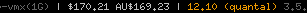

# MtGox Ticker for Xmobar

A simple Python script that pulls the last transacted price from the MtGox bitcoin exchange.

## Setup

1. Put mtgox.py in your path;
2. `chmod +x mtgox.py`;
3. Add `Run Com "mtgox.py" [] "mtgox" 600` to .xmobarrc commands;
4. Include `%mtgox%` in your .xmobarrc template.

Requires the requests Python module:

    sudo pip install requests

